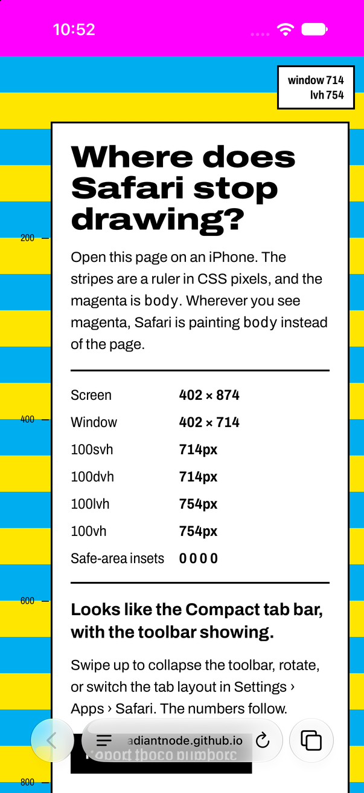
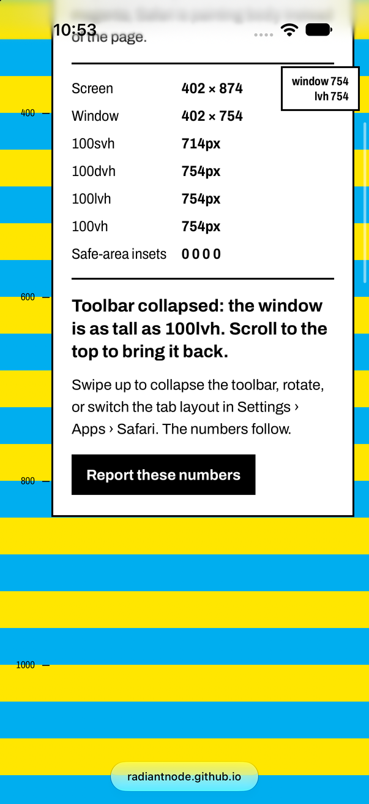
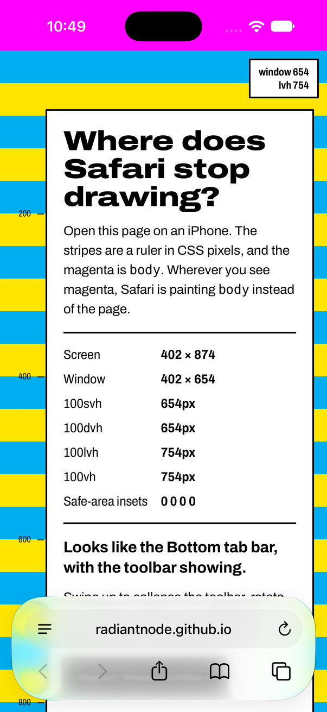

# iOS Safari Gotchas

An [agent skill](https://agentskills.io) for the iPhone Safari bugs that desktop browsers and
headless WebKit never show, measured on iOS 27 with Safari's Liquid Glass toolbar. Examples:
a flat colour band or the wrong tint behind the bottom toolbar, a status-bar colour that
`theme-color` won't change, a hero that stops short of the screen's edge with one tab layout
but not another, `100vh`/`dvh`/`svh`/`lvh` numbers that don't add up, safe-area insets that
read 0 despite `viewport-fit=cover`, and scroll-linked JS that flashes during a flick.

Every rule in it was first seen on a real iPhone and then pinned down in the iOS simulator by
changing one thing at a time. Each one comes with the fix and a way to verify it. With the
skill installed, your agent reads it before touching anything anchored to a screen edge or
driven by scroll position, and measures instead of guessing from CSS.

**Try it on your phone:** open
[radiantnode.github.io/ios-safari-gotchas-skill](https://radiantnode.github.io/ios-safari-gotchas-skill/)
in iPhone Safari. The page is a striped ruler that shows where Safari stops drawing your
page, where `body` shows through, and your real `svh`/`dvh`/`lvh` and safe-area numbers.

| Compact tab bar | Compact, toolbar collapsed | Bottom tab bar |
|:---:|:---:|:---:|
|  |  |  |
| window 714, `lvh` 754 | window 754: the page runs under the pill | window 654: 60pt less than Compact |

<sub>iPhone 18 Pro, iOS 27.0 simulator. Same screen and numbers as the iPhone 17 Pro.</sub>

## What's covered

| § | Gotcha |
|---|--------|
| 1 | The flat strip behind the bottom toolbar, and the viewport-sized sticky/fixed element that ratchets the page into it |
| 2 | The colour behind the status bar: what Safari samples, when it falls back to `theme-color` |
| 3 | Safari caches both decisions per URL path, so query-string probes lie |
| 4 | Viewport units and insets: measured `svh`/`lvh`/`dvh`/`vh`, insets, by phone and tab layout |
| 5 | Scroll-linked JS during a flick: drive it from `requestAnimationFrame` |
| 6 | The rubber band: `scrollY` outside the document, and how to take it back out |
| 7 | CSS transitions that WebKit parks at first paint |
| 8 | Things that looked like fixes and were not |
| 9 | Testing pitfalls that produce false results |
| 10 | The strip's colour is `body`'s (live), and so is the status bar's (once, at load) |
| 11 | A 1px hairline at a seam measured with `offsetHeight` |
| 12 | How far the page runs under the toolbar depends on Safari's tab layout (Compact vs Bottom) |

## Install

**With the [skills CLI](https://github.com/vercel-labs/skills)** (Claude Code, Codex, Cursor
and other agents):

```sh
npx skills add radiantnode/ios-safari-gotchas-skill
```

**As a Claude Code plugin:**

```
/plugin marketplace add radiantnode/ios-safari-gotchas-skill
/plugin install ios-safari-gotchas@ios-safari-gotchas
```

**By hand:** copy `skills/ios-safari-gotchas/` into your agent's skills directory
(`~/.claude/skills/` for Claude Code). For claude.ai, zip that folder and upload it under
Settings › Capabilities › Skills.

## Verifying needs a Mac

The rules and fixes work anywhere. The verification recipes in
[`references/verifying.md`](skills/ios-safari-gotchas/references/verifying.md) drive the iOS
simulator with `xcrun simctl`, so they need macOS with Xcode and an iOS runtime. Pixel
sampling uses Python with Pillow. Frame extraction for filmed effects uses ffmpeg, either
local or in Docker. Taps, swipes and rotation need injected input such as
[`idb`](https://github.com/facebook/idb), because `simctl` can't do them.

## Measured on

iOS 27 Safari: an iPhone 17 Pro, plus the iOS 27.0 simulator on the iPhone 15 Pro Max,
18 Pro and 18 Pro Max, in the Compact and Bottom tab layouts. The Top layout has not been
measured. Safari changes between releases, so trust a fresh measurement over a number here.
If one no longer holds, please open an issue with the device, iOS version and tab layout.

## Layout

```
skills/ios-safari-gotchas/
  SKILL.md                        the rules and fixes, §1–§12
  references/verifying.md         simulator recipes: screenshots, pixel sampling, filming
  references/testing-pitfalls.md  headless harness traps (§9)
  references/reveal-ink.md        holding text and ground under a reveal's overhang (§12)
  scripts/ink.py, sheet.py        samplers for filmed frames
.claude-plugin/                   Claude Code plugin and marketplace manifests
docs/                             the live probe page (GitHub Pages), its screenshots, and probes/
```

## License

[MIT](LICENSE)
